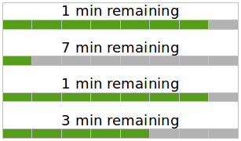

# Lecture 1: Computational Thinking

## Computational Thinking

* is considered one of the fundamental skills of the 21st century.
* It is about expressing problems and their solutions in ways that a computer could execute.
* coined by Jeanette Wing in 2006 (here is the [original article published in the Communications of the ACM](http://www.cs.cmu.edu/afs/cs/usr/wing/www/publications/Wing06.pdf)).

## Example-1: Download Times

How many minutes will it take until all 4 files have finished downloading?

## Example-2: Maximal Gain (★★☆☆☆)

The grid below contains numbers and two special cells S (for start) and G (for goal). The task: Find the path from S to G on which the sum of the numbers on the visited fields is the highest. But: you are only allowed to step upwards and to the right (in any order you like), so not down or to the left.

What is the maximal sum that can be gained this way, and through which path?

What is your thought process to come up with your answer? (what is your thought-algorithm to calculate the answer?)

## Example-3. Number Segments (★★★☆☆)

Form teams for this exercise.

In a house with 10 floors the lift shows the current floor with a 7-segment digital number display. The numbers 0 (for ground floor) to 9 look like this:

Thus, to display a number, at least 2 and at most 7 of the segments are switched on.

Recently one of the segments was broken and did not switch on at all. Nevertheless it was possible to recognize all numbers and tell them apart. Which segment(s) could have been the broken one?

What is your algorithm to calculate the answer?
